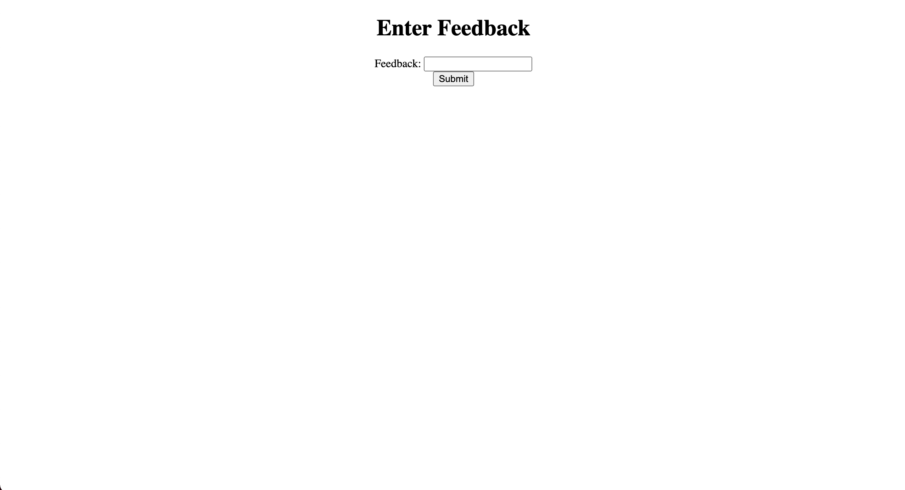
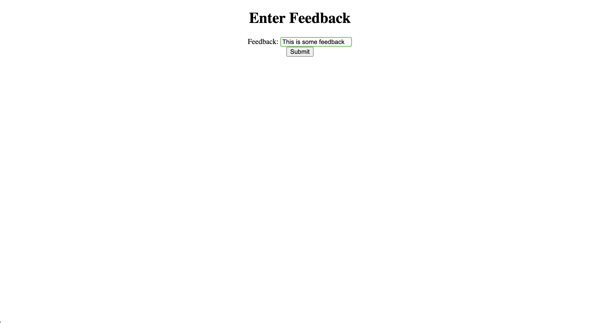
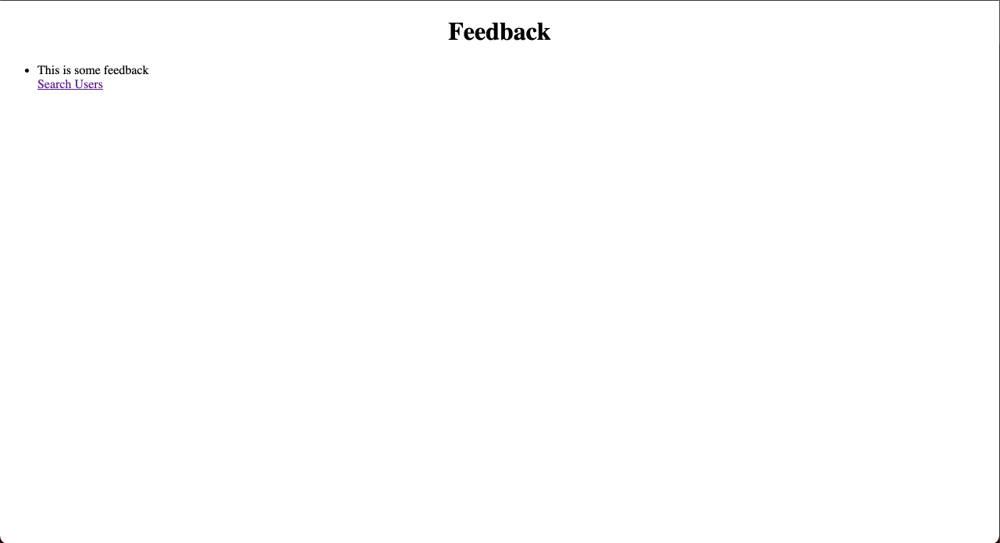
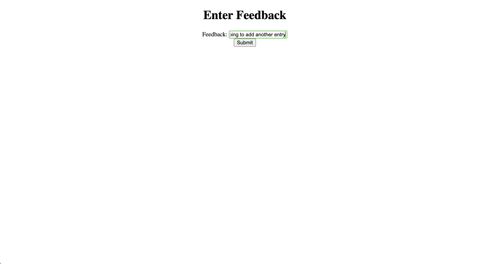
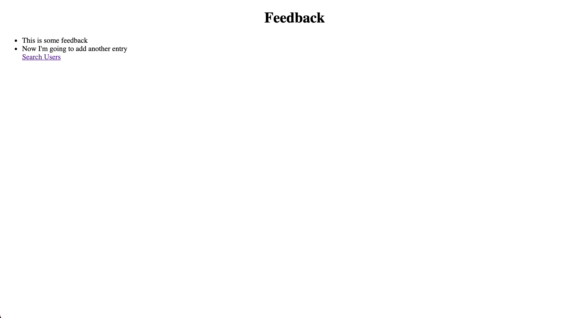

# Displaying User Feedback

This web application adds and displays feedback entered by the user...

## Features

	- Adds and gets feedback from a mySQL database using a rest controller
	- User feedback is captured and displayed using rest endpoints
	- User is redirected to feedback list after submission to view all recorded feedback
	- Hyperlink back to enter feedback page for multiple entries

## Installation

	- Clone and pull source code from provided github repository
	- Run the SpringApplication 

## Code

	https://github.com/nicholas-auyeung/Displaying-User-Feedback

## Flow

1. Go to https://start.spring.io/

2. Enter the appropriate spring project settings:

	Project: Project
	Language: Java
	Spring Boot: 2.4.1
	Enter package names
	Packaging: Jar
	Java: 8

3. Enter the appropriate spring project dependencies:
	
	Spring Boot DevTools
	Lombok
	Spring Web
	MYSQL Driver
	Spring Data JPA

4. Import into Eclipse EE as maven project

5. Inside 'displayfeedback' maven project...src/main/java create controller, dao, entity, repository, and service packages.

6. Define src/main/resources/application.properties with appropriate url/uri pattern prefix/suffix and database settings/credentials.

7. Create entity Feedback class inside 'entity' package.

8. Define Feedback class with proper entity attributes and annotations from Sping JPA and Project Lombak.

9. Create Feedback repository for user inside 'repository' package.

10. Define 'FeedbackRepository' interface extending 'CrudRepository'.

11. Create dao interface for user inside 'dao' package.

12. Define 'FeedbackDAO' interface with appropriate dao operations.

13. Create FeedbackDAO implements class inside 'dao' package.

14. Define 'FeedbackDAOImpl' class implementing the 'FeedbackDAO' interface defining all abstract methods with dao operations.

15. Create service interface for user inside 'service' package.

16. Define 'FeedbackService' interface with appropriate CRUD operation functions.

17. Create FeedbackService implements class inside 'service' package.

18. Define 'FeedbackServiceImpl' implementing the 'FeedbackService' interface defining all abstract methods with functions from defined 'FeedbackDAO' interface.

19. Create REST feedback model view controller inside 'controller' package.

20. Define 'FeedbackRESTController' class with appropriate model, view, and REST operations.

21. Create feedback model view controller inside 'controller' package.

22. Define 'FeedbackController' class with appropriate model and view operations.

23. Create new folder directory inside src/main/

24. New folder path: /webapp/WEB-INF/views

25. Inside 'views' folder create corresponding appropriate jsp pages.

## Usage
Once run, navigate to localhost:8080/feedback on a web browser.
	
	The enter feedback page will appear prompting the user for feedback.

	On clicking the 'submit' button user will be redirected to the feedback page.

	
	The user can click the 'Enter more feedback' hyper link to enter more feedback.

